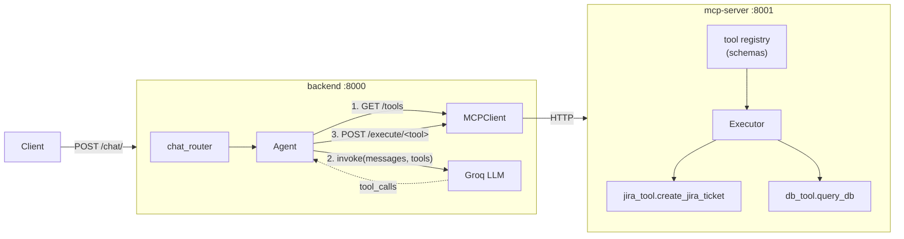

# AI Copilot MCP

An LLM-powered chat copilot that decides, on its own, when to call a tool instead of just answering — built around a small [MCP](https://modelcontextprotocol.io/)-style tool server so new capabilities (Jira, SQL, and beyond) can be added without touching the agent or the LLM-calling code.

Ask it something in natural language; a Groq-hosted LLM either answers directly or picks one of the tools advertised by the MCP server, the backend executes it over HTTP, and the result comes back to the caller.

```
POST /chat/ { "prompt": "Create a Jira ticket to fix the login bug" }
      │
      ▼
   backend picks the tool, mcp-server runs it
      │
      ▼
{ "response": { "status": "success", "result": { "ticket_id": "JIRA-1234" } } }
```

## Architecture

Two independent FastAPI services talk over HTTP. The backend owns the conversation and the LLM call; the mcp-server owns tool discovery and execution — it doesn't know or care what's calling it.



**Request flow** (`backend/services/agent.py`):
1. Fetch the available tools from the MCP server (`GET /tools`) as OpenAI-style function schemas.
2. Send the user's message + tool schemas to the LLM.
3. If the LLM responds with a tool call, execute it on the MCP server (`POST /execute/{tool_name}`) and return the result.
4. Otherwise, return the LLM's plain-text response.

## Tech stack

| Layer         | Choice                                   |
| ------------- | ----------------------------------------- |
| API framework | FastAPI (both services)                    |
| LLM provider  | [Groq](https://groq.com/) (OpenAI-compatible tool-calling API) |
| Validation    | Pydantic v2                                |
| HTTP client   | httpx (async)                              |
| Tests         | pytest                                     |
| Packaging     | Docker + Docker Compose                    |

## Project structure

```
backend/                 # conversational API — owns the LLM call
  api/chat_router.py        POST /chat/
  services/agent.py         orchestrates: fetch tools -> ask LLM -> execute tool
  services/llm.py           thin Groq client wrapper
  mcp_client/client.py      HTTP client for the mcp-server
  tests/

mcp-server/               # tool registry + execution — the "MCP" side
  registry.py                tool metadata -> OpenAI function schema
  executor.py                validates payload, dispatches to a tool function
  schemas.py                 Pydantic request schemas per tool
  tools/jira_tool.py         create_jira_ticket (reference implementation)
  tools/db_tool.py           db_query (reference implementation)
  tests/

docs/GMAIL_AGENT_PLAN.md  # design doc for the next tool (see Roadmap)
docker-compose.yml
```

## Getting started

### Option A — Docker Compose (recommended)

```bash
cp backend/.env.example backend/.env   # then fill in GROQ_API_KEY
docker compose up --build
```

- backend: http://localhost:8000
- mcp-server: http://localhost:8001

### Option B — Run locally

Each service has its own dependencies; run them in separate terminals.

```bash
# terminal 1 — mcp-server
cd mcp-server
python -m venv .venv && .venv/Scripts/activate   # source .venv/bin/activate on macOS/Linux
pip install -r requirements.txt
uvicorn main:app --reload --port 8001

# terminal 2 — backend
cd backend
python -m venv .venv && .venv/Scripts/activate
pip install -r requirements.txt
cp .env.example .env   # fill in GROQ_API_KEY
uvicorn main:app --reload --port 8000
```

Get a free API key at [console.groq.com](https://console.groq.com/keys).

### Try it

```bash
curl -X POST http://localhost:8000/chat/ \
  -H "Content-Type: application/json" \
  -d '{"prompt": "Create a Jira ticket titled \"Fix login bug\" with description \"Users cannot log in on Safari\""}'
```

## Available tools

The mcp-server currently exposes two reference tools — real implementations, but with side effects stubbed out (no live Jira/DB credentials wired in) so the project runs out of the box:

| Tool                 | Description                                   | File                          |
| --------------------- | ---------------------------------------------- | ------------------------------ |
| `create_jira_ticket`  | Create a Jira ticket from a title + description | `mcp-server/tools/jira_tool.py` |
| `db_query`            | Run a SQL query and return the results          | `mcp-server/tools/db_tool.py`   |

Adding a new tool is three steps: write the function in `mcp-server/tools/`, add a Pydantic request schema in `schemas.py`, and register both in `TOOL_REGISTRY`/`TOOL_MAP` (`registry.py`, `executor.py`). The backend and the LLM prompt need no changes — the tool list is discovered at runtime via `GET /tools`.

## Testing

```bash
cd mcp-server && pip install -r requirements-dev.txt && pytest
cd backend && pip install -r requirements-dev.txt && pytest
```

## Roadmap

[`docs/GMAIL_AGENT_PLAN.md`](docs/GMAIL_AGENT_PLAN.md) is a design doc for the next tool: a Gmail agent that drafts emails, pauses for human review/edit, and only sends on explicit confirmation. It works through OAuth flow options, a server-side draft store with TTL expiry, and the security tradeoffs of letting an LLM send email on your behalf — written before writing any code, to think through the human-in-the-loop design up front.

## License

[MIT](LICENSE)
